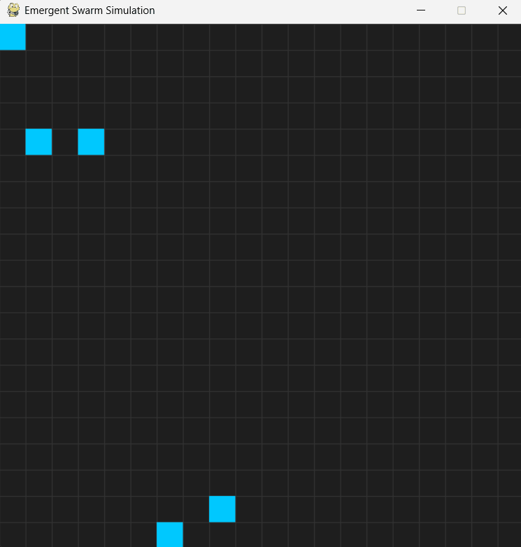
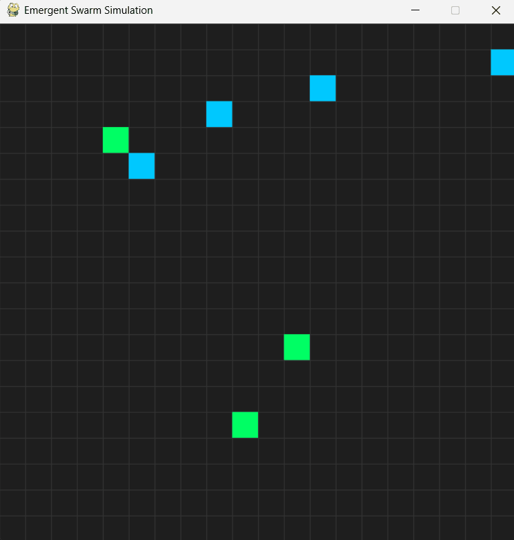

# Decentralized Swarm Emergence

A controlled study of emergent coordination in decentralized multi-agent reinforcement learning systems under structured constraints.


---

## Current Status

Active development — Version 1 simulation environment and metrics infrastructure implemented.

Current implemented systems include:

* multi-agent grid simulation
* stochastic decentralized movement
* target collection environment
* episode reset system
* timestep tracking
* movement cost tracking
* metrics logging pipeline
* CSV experiment logging

---

## Research Space

We model emergent coordination as a function:

E(α, b, N)

Where:

* α → incentive structure (reward topology)
* b → communication bandwidth (information constraint)
* N → number of interacting agents (scale)

This defines a behavioral phase space for swarm intelligence and decentralized coordination.

---

## Core Hypothesis

Coordination is not a fixed property of agents — it is an emergent function of constraints.

Small changes in:

* reward topology
* communication bandwidth
* system scale

can induce phase-transition-like shifts in collective swarm behavior.

---

## System View (Concept Map)

```text
            Communication (b)
                  ↑
                  │
      low         │         high
                  │
                  │
Reward (α) ───────┼────────────→ Scale (N)
                  │
                  │
```

Emergent coordination is studied as transitions within this space.

---

## Experimental Progression

This repository is structured as a sequence of increasingly constrained experimental systems.

### v1 — Incentive-Driven Emergence

Coordination under reward variation only
→ explores α axis

📄 Paper: [v1 Reward Topology](docs/papers/v1_reward_topology.pdf)

---

### v2 — Communication-Constrained Coordination

Coordination under bandwidth limits
→ explores b axis

📄 Paper: [v2 Communication Bandwidth](docs/papers/v2_communication_bandwidth.pdf)

---

### v3 — Scaling & Robustness of Swarms

Coordination under increasing system size
→ explores N axis

📄 Paper: [v3 Scalability & Systems](docs/papers/v3_scalability_and_systems.pdf)

---

## Simulation Demos

| Mode           | Description                  | Link                                 |
| -------------- | ---------------------------- | ------------------------------------ |
| Manual Control | baseline agent movement      |        |
| Random Swarm   | stochastic baseline dynamics |    |
| Reward System  | incentive-driven interaction |  |

---

## Implemented Features

### Environment Systems

* multi-agent swarm environment
* stochastic decentralized movement
* grid-based spatial simulation
* target collection mechanics
* episode reset lifecycle
* timestep management

### Metrics & Experimentation

* movement cost tracking
* success/failure episode tracking
* CSV experiment logging
* reproducible episode statistics
* environment instrumentation

### Planned Systems

* partial observability
* local observation tensors
* shared-policy PPO
* PettingZoo integration
* communication-constrained agents
* emergence analysis pipelines

---

## Research Outputs

The project aims to generate:

* emergence curves over α
* bandwidth threshold behavior (b*)
* scaling crossover regimes (N*)
* robustness under failure conditions
* coordination efficiency metrics
* statistical emergence validation
* swarm phase-transition analysis

---

## Repository Structure

```text
decentralized-swarm-emergence/
│
├── docs/             # Research papers (v1, v2, v3)
├── demos/            # Simulation outputs (GIFs/videos)
│
├── envs/             # Swarm environments
├── agents/           # Policies (PPO, shared networks)
├── rewards/          # Reward topology systems
├── metrics/          # Emergence + coordination metrics
├── experiments/      # Experiment execution layer
├── configs/          # Parameter sweeps (α, b, N)
├── visualization/    # Heatmaps, trajectories, phase plots
├── analysis/         # Statistical evaluation
├── logs/             # Training + experiment outputs
│
├── main.py
├── requirements.txt
└── README.md
```

---

## Setup

Clone the repository:

```bash
git clone https://github.com/Tybent18/decentralized-swarm-emergence.git
cd decentralized-swarm-emergence
```

Create virtual environment:

```bash
python -m venv venv
```

Activate environment:

### Windows

```bash
venv\Scripts\activate
```

### Linux / macOS

```bash
source venv/bin/activate
```

Install dependencies:

```bash
pip install -r requirements.txt
```

Run the simulation:

```bash
python main.py
```

---

## Reproducibility

Experiments are executed using:

* fixed random seeds
* logged episode metrics
* controlled environment parameters
* repeatable simulation conditions

This enables statistical evaluation of emergent coordination behavior across independent runs.

---

## Research Questions

* When does decentralized coordination emerge?
* How does reward structure reshape collective behavior?
* What is the minimal communication required for coordination?
* How does system scale change the nature of emergence?
* Do phase-transition-like behavioral regimes appear in swarm systems?
* Under what conditions does decentralized coordination outperform independent policies?

---

## Future Directions

* multi-agent PPO scaling (50–100 agents)
* structured communication protocols
* information-theoretic message analysis
* resilience under agent failure
* topology-aware coordination
* graph-based interaction modeling
* decentralized role specialization
* full phase diagram of E(α, b, N)

---

## License

MIT