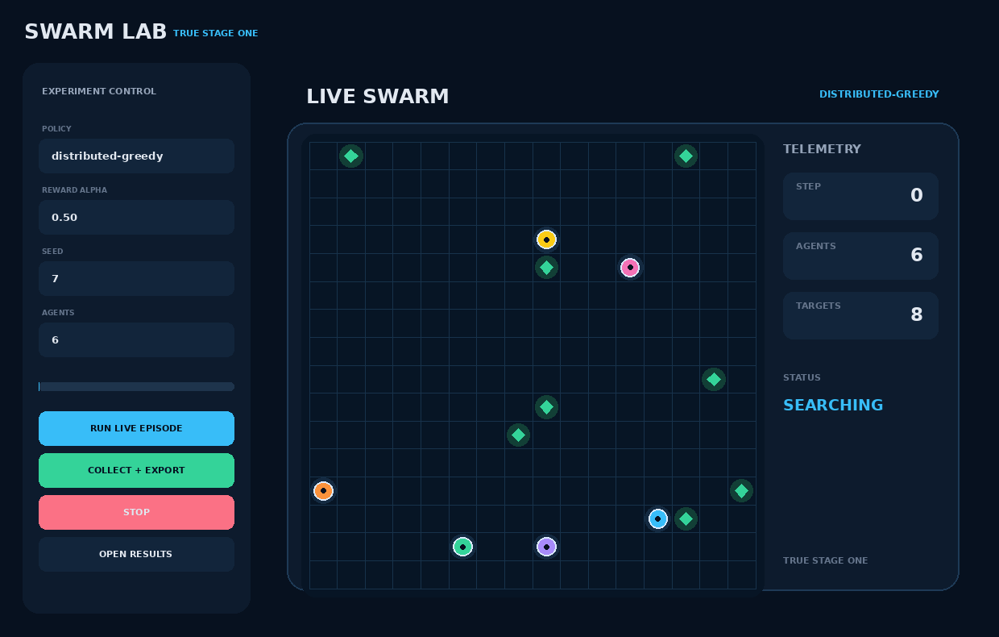
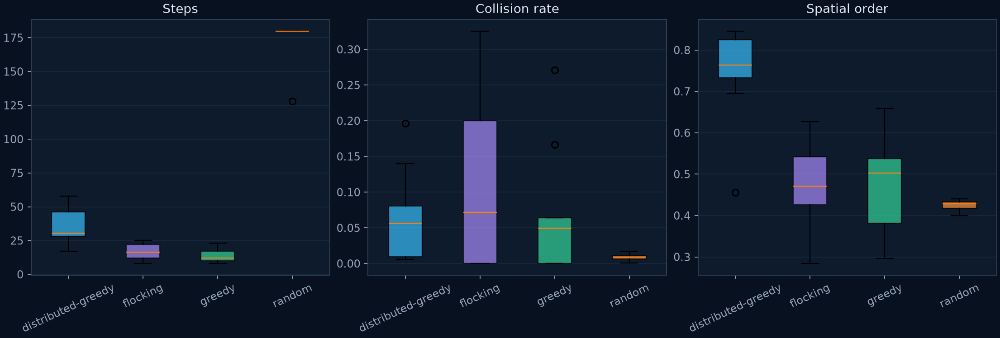
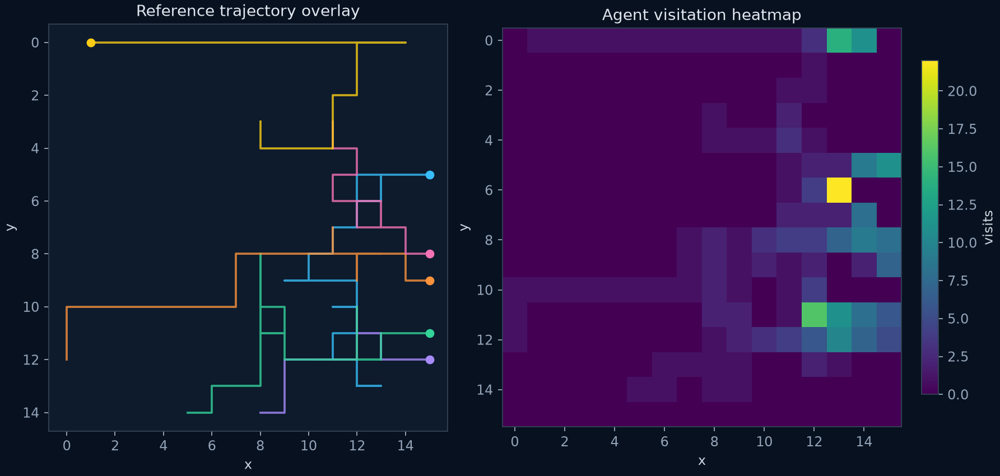

# Decentralized Swarm Emergence

**A reproducible laboratory for measuring when local multi-agent behavior becomes globally coordinated.**

True Stage One turns the original grid demo into an experiment platform aligned with the capstone study *Emergent Intelligence in Decentralized Swarms*. It provides correct PettingZoo semantics, fixed-shape anonymous observations, reward-topology control, heuristic baselines, one-click evidence collection, automated charts, and a game-like live simulation.

> Research boundary: Stage One validates the environment, instrumentation, and heuristic baselines. It does **not** claim trained PPO, learned communication, a critical α*, or a demonstrated phase transition.

## Live laboratory



The replacement demo is generated by the same world and policy code used by experiments. Compare it with the stochastic control:


## Start here

```bash
python -m venv .venv
source .venv/bin/activate          # Windows: .venv\Scripts\activate
pip install -e ".[dev]"
python main.py                     # opens the laboratory
```

The desktop interface includes:

- a live virtual environment with distinct moving drone avatars and telemetry;
- policy, reward α, seed, and swarm-size controls;
- **Run Live Episode**, **Stop**, **Collect + Export**, and **Open Results** buttons;
- a background collector that keeps the interface responsive;
- automatic CSV, summary, manifest, chart, heatmap, and trajectory exports.

## One-command evidence collection

```bash
python main.py collect --seeds 10 --output results/my_run
```

Each collection appends raw episode rows and rebuilds every derived artifact:

```text
results/my_run/
├── episodes.csv
├── summary.csv
├── manifest.json
└── charts/
    ├── behavioral_metrics.png
    ├── reward_topology_baselines.png
    └── trajectory_and_heatmap.png
```

The repository also contains a safe **Evidence Export** GitHub Action. Enter the next seed and batch size from the Actions tab; it runs the entire collector and provides a downloadable evidence bundle without writing to the repository.

## Frozen Stage One evidence

The committed [baseline dataset](data/stage_one_baseline/episodes.csv) contains 200 recorded conditions: 4 policies × 5 α values × 10 seeds. Because heuristic actions do not learn from reward, α changes recorded return but should not change their trajectories. That invariant is deliberate.

| Policy | Success | Mean completion | Mean steps | Mean distance |
| --- | ---: | ---: | ---: | ---: |
| Random | 10% | 70% | 174.8 | 787.7 |
| Greedy | 100% | 100% | 13.5 | 81.0 |
| Flocking | 100% | 100% | 16.5 | 90.9 |
| Distributed-greedy oracle | 100% | 100% | 34.9 | 87.4 |

These results establish discriminative baselines and a functioning measurement stack. They do not establish emergence. See the [Stage One results note](docs/stage-one-results.md) for interpretation and limitations.





## Capstone alignment

| Capstone requirement | Stage One status |
| --- | --- |
| 5–10 decentralized agents | Implemented and configurable |
| Radius-limited local observations | Fixed-shape 3-channel tensors |
| No identifiers in observations | Implemented |
| Sparse/weak global and hybrid α rewards | Implemented with literal per-agent local credit |
| PettingZoo MARL environment | Parallel API contract tested |
| Greedy and flocking baselines | Implemented and measured |
| Repeated seeded runs | Automated and appendable |
| Success, time, collision, distance, efficiency | Exported |
| Entropy, spatial order, inter-agent distance, roles | Exported |
| Trajectory overlays and heatmaps | Exported |
| Shared-policy PPO and Independent PPO | Next stage; not claimed |
| Minimal communication and bandwidth b | Future stage; not claimed |
| Statistically validated α* | Requires learned-policy data |

Read the [Stage One methods](docs/stage-one-methods.md), [verification record](docs/stage-one-verification.md), [research roadmap](docs/roadmap.md), and complete [research document library](docs/research/README.md).

## Architecture

```text
ExperimentConfig
      │
      ▼
Deterministic SwarmWorld ─────► Live laboratory / GIF demos
      │
      ▼
PettingZoo ParallelEnv ───────► future learned policies
      │
      ▼
Baseline policies ─► Episode metrics ─► CSV + summary + charts + manifest
```

| Module | Responsibility |
| --- | --- |
| `swarm_lab/world.py` | deterministic grid physics and event attribution |
| `swarm_lab/environment.py` | PettingZoo lifecycle, observations, and α rewards |
| `swarm_lab/policies.py` | random, greedy, flocking, and oracle baselines |
| `swarm_lab/experiment.py` | episodes, metrics, appendable sweeps, provenance |
| `swarm_lab/visualization.py` | simulation frames and publication-ready figures |
| `swarm_lab/gui.py` | interactive controls, progress, cancellation, export |

## Verification

```bash
ruff check .
pytest -q
python main.py run --policy greedy --seed 7 --alpha 0.5
python main.py demo
```

The tests include the official PettingZoo parallel API test, seeded determinism, fixed observation spaces, local/global reward attribution, safe cancellation, and complete artifact export.

## Research sequence

1. **True Stage One - complete:** environment correctness, observability, metrics, baselines, one-click collection.
2. Shared-policy and Independent PPO under identical budgets.
3. Pre-registered α sweep and statistical emergence testing.
4. Minimal communication and bandwidth constraints (`b`).
5. Scaling and failure resilience (`N`).
6. Full empirical phase space `E(α,b,N)`.

## Research documents

### Current five-document packet

- [True Stage One Technical Report](docs/research/stage-one-technical-report.pdf) — implemented environment, baseline, instrumentation, and frozen evidence
- [Pre-Registered Experimental Protocol](docs/research/experimental-protocol.pdf) — next shared-policy PPO versus Independent PPO experiment
- [Tier 1: Capstone Research Concept](docs/research/tier-1-capstone.pdf) — reward topology and learned coordination
- [Tier 2: Master's Research Design](docs/research/tier-2-masters.pdf) — communication bandwidth and topology
- [Tier 3: Doctoral Research Agenda](docs/research/tier-3-doctoral-agenda.pdf) — formal models, robustness, and scaling

Use the [navigable research library](docs/research/README.md) for reading order, scope, and evidence status.

### Historical V1–V3 papers

- [V1: Reward Topology](docs/papers/v1_reward_topology.pdf)
- [V2: Communication Bandwidth](docs/papers/v2_communication_bandwith.pdf)
- [V3: Scalability and Systems](docs/papers/v3_scalability_and_systems.pdf)

## License

[MIT](LICENSE)
