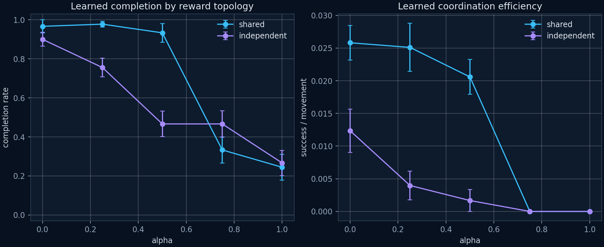

# Learned Stage One results

## Status

The registered visible-neighbor sweep completed successfully. It trained 30 policies:

- two architectures: shared PPO and Independent PPO;
- five reward weights: α = 0, 0.25, 0.5, 0.75, and 1;
- three independent training seeds per condition;
- 30 updates × 4 episodes per trained policy; and
- five held-out evaluation seeds per policy, producing 150 evaluation episodes.

Training seeds `0–2` and evaluation seeds `100–104` were disjoint. Manifest checksums were verified after collection.

## Primary result

The preregistered hypothesis was **not supported**. Increasing team-reward weight did not improve either primary coordination outcome. The direction was strongly negative for both architectures.

| Architecture | Outcome | α = 0 | α = 1 | Difference | 95% bootstrap CI | Welch p |
|---|---:|---:|---:|---:|---:|---:|
| Shared PPO | Completion rate | 0.967 | 0.244 | -0.722 | [-0.833, -0.600] | 0.0027 |
| Shared PPO | Coordination efficiency | 0.0258 | 0.0000 | -0.0258 | [-0.0291, -0.0218] | 0.0068 |
| Independent PPO | Completion rate | 0.900 | 0.267 | -0.633 | [-0.844, -0.356] | 0.0463 |
| Independent PPO | Coordination efficiency | 0.0123 | 0.0000 | -0.0123 | [-0.0192, -0.0082] | 0.0704 |

Shared PPO completion remained high through α = 0.5, then fell to 0.333 at α = 0.75 and 0.244 at α = 1. Independent PPO declined more steadily from 0.900 at α = 0 to 0.267 at α = 1. Every training seed in both architectures had lower mean completion at α = 1 than at α = 0.

Shared PPO collision rate also rose from 0.0381 to 0.1267 (difference 0.0885, 95% bootstrap CI [0.0557, 0.1214], Welch p = 0.0208).

## Interpretation

These results support a narrower conclusion: with the present observations, weak reward scheme, PPO implementation, and fixed training budget, increasing global reward weight made the learning problem harder rather than producing better coordination. A plausible mechanism is degraded credit assignment: every agent receives the same collection signal even when only one agent's action caused it. That mechanism remains an explanation to test, not an established fact.

The result does **not** show that individual incentives are universally superior, that coordination cannot emerge, or that a phase transition exists near α = 0.75. It also does not test learned communication. The α = 0.25 shared-policy condition achieved the highest raw completion rate (0.978), but this was not the preregistered endpoint contrast and should be treated as exploratory.

## Next experiment

The appropriate follow-up is replication with more independent training seeds and a training-budget sensitivity study. Neighbor-hidden and neighbor-shuffled ablations can then determine how much performance depends on the anonymous spatial neighbor channel. Reward normalization or counterfactual credit assignment should be introduced only as separately registered conditions, not retrofitted into this result.

## Evidence

The committed evidence directory contains:

- `training.csv`: 900 update-level training records;
- `evaluations.csv`: 150 held-out evaluation episodes;
- `analysis.csv`: policy-seed-level endpoint inference;
- `manifest.json`: configuration, seeds, claim boundary, and SHA-256 checksums; and
- `charts/learned_reward_topology.png`: primary outcome visualization.

Model checkpoints were generated during the run but are not committed because they are derived binary artifacts. The registered runner deterministically regenerates them from the recorded configuration and seeds.
